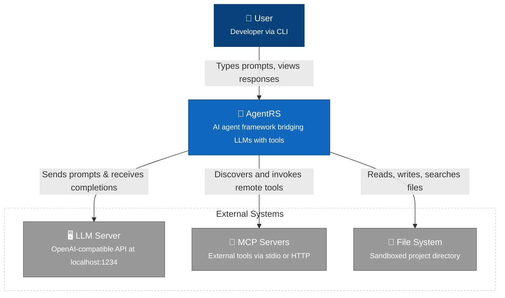
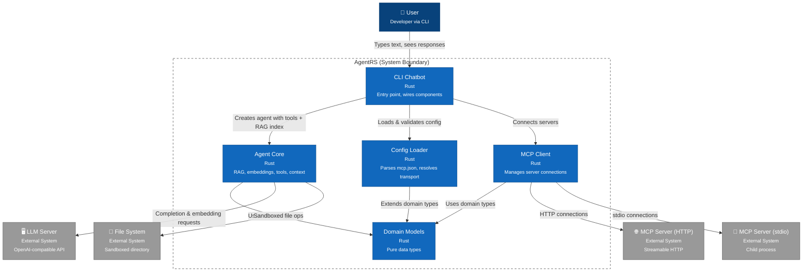
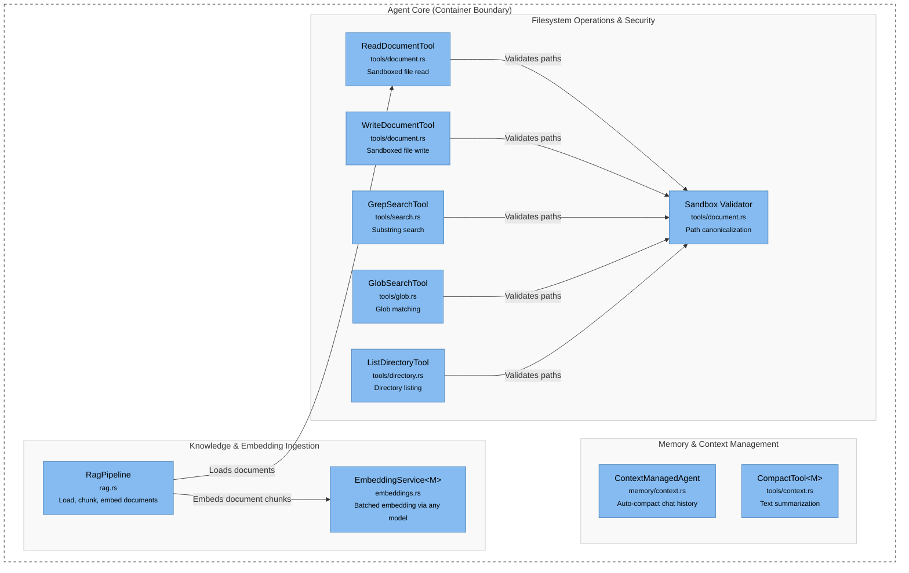

# C4 Architecture Diagrams

## System Context (Level 1)

```mermaid
flowchart TB
    user["👤 User<br/><small>Developer via CLI</small>"]:::person
    agentrs["🤖 AgentRS<br/><small>AI agent framework bridging LLMs with tools</small>"]:::system
    
    subgraph External ["External Systems"]
        llm["🖥️ LLM Server<br/><small>OpenAI-compatible API at localhost:1234</small>"]:::external
        mcp["🔌 MCP Servers<br/><small>External tools via stdio or HTTP</small>"]:::external
        fs["📁 File System<br/><small>Sandboxed project directory</small>"]:::external
    end

    user -->|Types prompts, views responses| agentrs
    agentrs -->|Sends prompts & receives completions| llm
    agentrs -->|Discovers and invokes remote tools| mcp
    agentrs -->|Reads, writes, searches files| fs

    classDef person fill:#08427b,stroke:#073b6e,color:#ffffff
    classDef system fill:#1168bd,stroke:#0b4c8c,color:#ffffff
    classDef external fill:#999999,stroke:#666666,color:#ffffff
    style External fill:none,stroke:#cccccc,stroke-dasharray: 3 3
```

## Container Diagram (Level 2)

```mermaid
flowchart TB
    user["👤 User<br/><small>Developer via CLI</small>"]:::person
    
    subgraph AgentRS ["AgentRS (System Boundary)"]
        cli["CLI Chatbot<br/><small>Rust</small><br/><small>Entry point, wires components</small>"]:::container
        agent["Agent Core<br/><small>Rust</small><br/><small>RAG, embeddings, tools, context</small>"]:::container
        config["Config Loader<br/><small>Rust</small><br/><small>Parses mcp.json, resolves transport</small>"]:::container
        mcp["MCP Client<br/><small>Rust</small><br/><small>Manages server connections</small>"]:::container
        domain["Domain Models<br/><small>Rust</small><br/><small>Pure data types</small>"]:::container
    end

    llm["🖥️ LLM Server<br/><small>External System</small><br/><small>OpenAI-compatible API</small>"]:::external
    fs["📁 File System<br/><small>External System</small><br/><small>Sandboxed directory</small>"]:::external
    mcp_http["🌐 MCP Server (HTTP)<br/><small>External System</small><br/><small>Streamable HTTP</small>"]:::external
    mcp_stdio["🔌 MCP Server (stdio)<br/><small>External System</small><br/><small>Child process</small>"]:::external

    user -->|Types text, sees responses| cli
    
    cli -->|Creates agent with tools + RAG index| agent
    cli -->|Loads & validates config| config
    cli -->|Connects servers| mcp
    
    agent -->|Uses domain types| domain
    config -->|Extends domain types| domain
    mcp -->|Uses domain types| domain
    
    agent -->|Completion & embedding requests| llm
    agent -->|Sandboxed file ops| fs
    
    mcp -->|HTTP connections| mcp_http
    mcp -->|stdio connections| mcp_stdio

    classDef person fill:#08427b,stroke:#073b6e,color:#ffffff
    classDef container fill:#1168bd,stroke:#0b4c8c,color:#ffffff
    classDef external fill:#999999,stroke:#666666,color:#ffffff
    style AgentRS fill:none,stroke:#333333,stroke-dasharray: 5 5
```

## Component Diagram (Level 3) - Agent Core

```mermaid
flowchart TB
    subgraph AgentCore ["Agent Core (Container Boundary)"]
        subgraph Ingestion ["Knowledge & Embedding Ingestion"]
            rag["RagPipeline<br/><small>rag.rs</small><br/><small>Load, chunk, embed documents</small>"]:::component
            embed["EmbeddingService&lt;M&gt;<br/><small>embeddings.rs</small><br/><small>Batched embedding via any model</small>"]:::component
        end

        subgraph Memory ["Memory & Context Management"]
            ctx["ContextManagedAgent<br/><small>memory/context.rs</small><br/><small>Auto-compact chat history</small>"]:::component
            compact["CompactTool&lt;M&gt;<br/><small>tools/context.rs</small><br/><small>Text summarization</small>"]:::component
        end

        subgraph Security ["Filesystem Operations & Security"]
            read["ReadDocumentTool<br/><small>tools/document.rs</small><br/><small>Sandboxed file read</small>"]:::component
            write["WriteDocumentTool<br/><small>tools/document.rs</small><br/><small>Sandboxed file write</small>"]:::component
            grep["GrepSearchTool<br/><small>tools/search.rs</small><br/><small>Substring search</small>"]:::component
            glob["GlobSearchTool<br/><small>tools/glob.rs</small><br/><small>Glob matching</small>"]:::component
            list["ListDirectoryTool<br/><small>tools/directory.rs</small><br/><small>Directory listing</small>"]:::component
            
            sandbox["Sandbox Validator<br/><small>tools/document.rs</small><br/><small>Path canonicalization</small>"]:::component
        end
    end

    rag -->|Embeds document chunks| embed
    rag -->|Loads documents| read
    
    read -->|Validates paths| sandbox
    write -->|Validates paths| sandbox
    grep -->|Validates paths| sandbox
    glob -->|Validates paths| sandbox
    list -->|Validates paths| sandbox

    classDef component fill:#85bbf0,stroke:#4a82b8,color:#000000
    style AgentCore fill:none,stroke:#333333,stroke-dasharray: 5 5
    style Ingestion fill:#f9f9f9,stroke:#cccccc
    style Memory fill:#f9f9f9,stroke:#cccccc
    style Security fill:#f9f9f9,stroke:#cccccc
```
