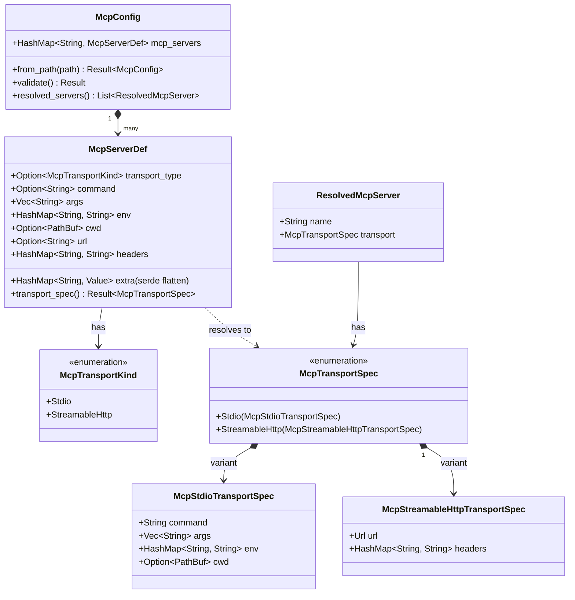
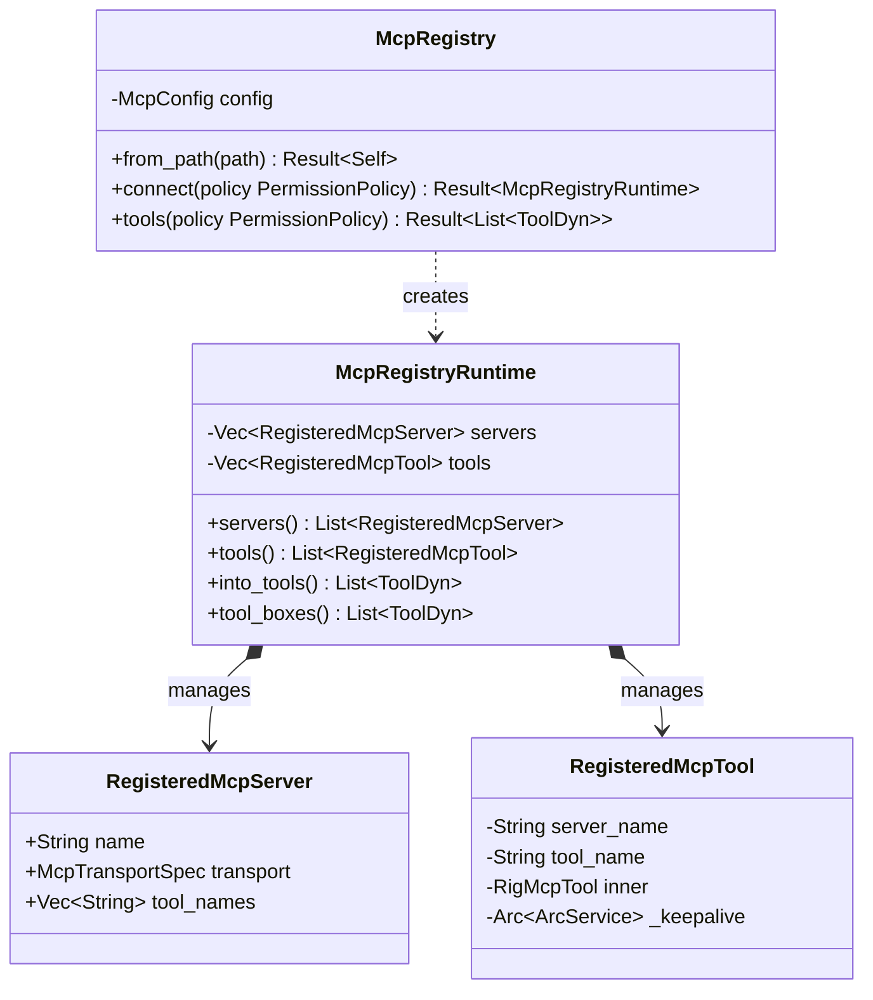
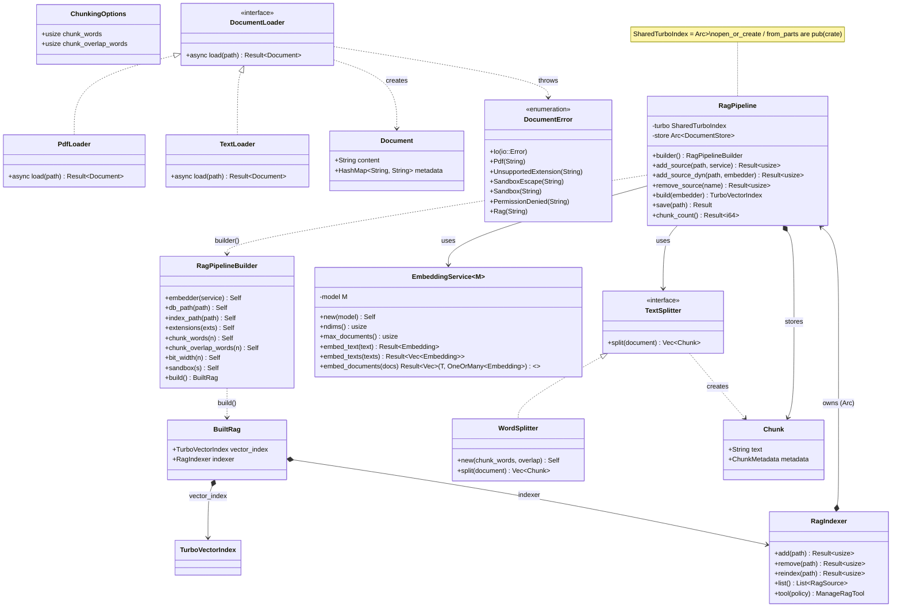
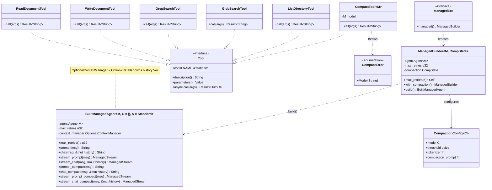

# Class / Type Diagram

To make the codebase structure easier to navigate, the type definitions are broken down into four thematic, logical diagrams:
1. [Crate Configuration & Transport Models](#1-crate-configuration--transport-models)
2. [MCP Registry & Connection Runtime](#2-mcp-registry--connection-runtime)
3. [RAG & Document Ingestion Pipeline](#3-rag--document-ingestion-pipeline)
4. [Agent Memory & Internal Tools](#4-agent-memory--internal-tools)

---

## 1. Crate Configuration & Transport Models

This diagram represents the parsing of MCP configuration (`mcp.json`) and the abstraction of STDIO or HTTP connection parameters.

---

## 2. MCP Registry & Connection Runtime

This diagram illustrates how connections to MCP servers are managed, spawned, and wrapped into Rig-compatible tools.

---

## 3. RAG & Document Ingestion Pipeline

This diagram shows how documents (PDF, Text, Markdown) are loaded, split into chunks, and loaded into the vector index using embedding models.

---

## 4. Agent Memory & Internal Tools

This diagram outlines the context-managed agent wrapper for conversation compaction and the set of sandboxed filesystem utilities.

