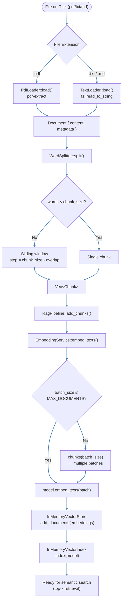
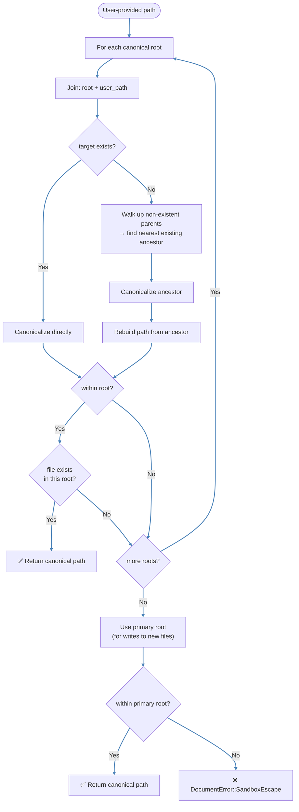
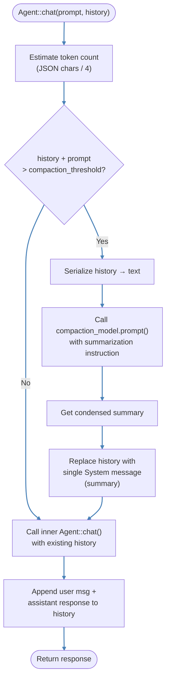

# Flowcharts

## RAG Document Processing Pipeline

```mermaid
flowchart TB
    Start(["File on Disk (pdf/txt/md)"]) --> Loader{File Extension}
    Loader -->|".pdf"| PdfLoader["PdfLoader::load()<br/>pdf-extract"]
    Loader -->|".txt / .md"| TextLoader["TextLoader::load()<br/>fs::read_to_string"]
    PdfLoader --> Doc["Document { content, metadata }"]
    TextLoader --> Doc
    Doc --> Splitter["WordSplitter::split()"]
    Splitter --> CheckChunk{"words < chunk_size?"}
    CheckChunk -->|No| SlidingWindow["Sliding window<br/>step = chunk_size - overlap"]
    CheckChunk -->|Yes| SingleChunk["Single chunk"]
    SlidingWindow --> Chunks["Vec&lt;Chunk&gt;"]
    SingleChunk --> Chunks
    Chunks --> RagPipe["RagPipeline::add_chunks()"]
    RagPipe --> Embed["EmbeddingService::embed_texts()"]
    Embed --> BatchLoop{"batch_size ≤ MAX_DOCUMENTS?"}
    BatchLoop -->|Yes| EmbedBatch["model.embed_texts(batch)"]
    BatchLoop -->|No| SplitBatch["chunks(batch_size)<br/>→ multiple batches"]
    SplitBatch --> EmbedBatch
    EmbedBatch --> Store["InMemoryVectorStore<br/>.add_documents(embeddings)"]
    Store --> Index["InMemoryVectorIndex<br/>.index(model)"]
    Index --> QueryReady["Ready for semantic search<br/>(top-k retrieval)"]
    linkStyle default stroke:#4a82b8,stroke-width:2px;
```

## Sandbox Path Validation

```mermaid
flowchart TB
    Input(["User-provided path"]) --> LoopStart["For each canonical root"]
    LoopStart --> Join["Join: root + user_path"]
    Join --> Exists{"target exists?"}
    Exists -->|Yes| CanonTarget["Canonicalize directly"]
    Exists -->|No| WalkUp["Walk up non-existent parents<br/>→ find nearest existing ancestor"]
    WalkUp --> CanonAncestor["Canonicalize ancestor"]
    CanonAncestor --> Rebuild["Rebuild path from ancestor"]
    Rebuild --> WithinRoot{"within root?"}
    CanonTarget --> WithinRoot
    WithinRoot -->|Yes| ExistsCheck{"file exists<br/>in this root?"}
    WithinRoot -->|No| NextRoot{"more roots?"}
    ExistsCheck -->|Yes| Success["✅ Return canonical path"]
    ExistsCheck -->|No| NextRoot
    NextRoot -->|Yes| LoopStart
    NextRoot -->|No| Primary["Use primary root<br/>(for writes to new files)"]
    Primary --> PrimaryCheck{"within primary root?"}
    PrimaryCheck -->|Yes| Success2["✅ Return canonical path"]
    PrimaryCheck -->|No| Fail["❌ DocumentError::SandboxEscape"]
    linkStyle default stroke:#4a82b8,stroke-width:2px;
```

## History Compaction (Context-Managed Agent)

```mermaid
flowchart TB
    In(["Agent::chat(prompt, history)"]) --> Estimate["Estimate token count<br/>(JSON chars / 4)"]
    Estimate --> Threshold{"history + prompt<br/>&gt; compaction_threshold?"}
    Threshold -->|No| NormalChat["Call inner Agent::chat()<br/>with existing history"]
    Threshold -->|Yes| Serialize["Serialize history → text"]
    Serialize --> Compact["Call compaction_model.prompt()<br/>with summarization instruction"]
    Compact --> Summary["Get condensed summary"]
    Summary --> Replace["Replace history with<br/>single System message<br/>(summary)"]
    Replace --> NormalChat
    NormalChat --> Append["Append user msg +<br/>assistant response to history"]
    Append --> Out(["Return response"])
    linkStyle default stroke:#4a82b8,stroke-width:2px;
```
