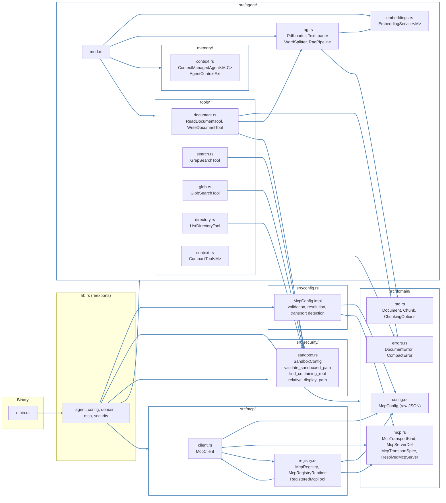

# Module Dependency Graph

```mermaid
graph LR
    subgraph Binary
        main_rs["main.rs"]
    end

    subgraph lib["lib.rs (reexports)"]
        lib_rs["agent, config, domain, mcp, security"]
    end

    subgraph domain["src/domain/"]
        domain_config["config.rs<br/>McpConfig (raw JSON)"]
        domain_mcp["mcp.rs<br/>McpTransportKind, McpServerDef<br/>McpTransportSpec, ResolvedMcpServer"]
        domain_rag["rag.rs<br/>Document, Chunk, ChunkingOptions"]
        domain_errors["errors.rs<br/>DocumentError, CompactError"]
    end

    subgraph security["src/security/"]
        security_sandbox["sandbox.rs<br/>SandboxConfig<br/>validate_sandboxed_path<br/>find_containing_root<br/>relative_display_path"]
    end

    subgraph config["src/config.rs"]
        config_rs["McpConfig impl<br/>validation, resolution, transport detection"]
    end

    subgraph agent["src/agent/"]
        agent_mod["mod.rs"]
        embeddings["embeddings.rs<br/>EmbeddingService&lt;M&gt;"]
        rag["rag.rs<br/>PdfLoader, TextLoader<br/>WordSplitter, RagPipeline"]

        subgraph memory["memory/"]
            context["context.rs<br/>ContextManagedAgent&lt;M,C&gt;<br/>AgentContextExt"]
        end

        subgraph tools["tools/"]
            document["document.rs<br/>ReadDocumentTool, WriteDocumentTool"]
            search["search.rs<br/>GrepSearchTool"]
            glob["glob.rs<br/>GlobSearchTool"]
            directory["directory.rs<br/>ListDirectoryTool"]
            compact["context.rs<br/>CompactTool&lt;M&gt;"]
        end
    end

    subgraph mcp["src/mcp/"]
        client["client.rs<br/>McpClient"]
        registry["registry.rs<br/>McpRegistry, McpRegistryRuntime<br/>RegisteredMcpTool"]
    end

    main_rs --> lib_rs
    lib_rs --> config_rs
    lib_rs --> domain
    lib_rs --> security
    lib_rs --> agent
    lib_rs --> mcp

    config_rs --> domain_config
    config_rs --> domain_mcp

    agent_mod --> embeddings
    agent_mod --> rag
    agent_mod --> memory
    agent_mod --> tools

    rag --> embeddings
    rag --> domain_rag

    document --> domain_errors
    document --> rag
    document --> security_sandbox
    search --> security_sandbox
    glob --> security_sandbox
    directory --> security_sandbox
    compact --> domain_errors

    client --> domain_config
    client --> domain_mcp
    client --> registry

    registry --> domain_config
    registry --> domain_mcp
    registry --> client
    
    style agent stroke:#4a82b8,stroke-width:2px,fill:none
    style memory stroke:#4a82b8,stroke-width:1.5px,fill:none
    style tools stroke:#4a82b8,stroke-width:1.5px,fill:none
    style domain stroke:#4a82b8,stroke-width:2px,fill:none
    style security stroke:#4a82b8,stroke-width:2px,fill:none
    style config stroke:#4a82b8,stroke-width:2px,fill:none
    style mcp stroke:#4a82b8,stroke-width:2px,fill:none
    
    linkStyle default stroke:#4a82b8,stroke-width:2px;
```
