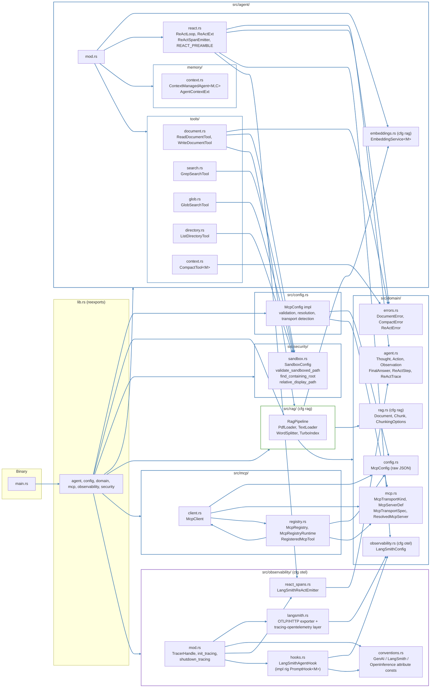

# Module Dependency Graph

```mermaid
graph LR
    subgraph Binary
        main_rs["main.rs"]
    end

    subgraph lib["lib.rs (reexports)"]
        lib_rs["agent, config, domain, mcp, observability, security"]
    end

    subgraph domain["src/domain/"]
        domain_config["config.rs<br/>McpConfig (raw JSON)"]
        domain_mcp["mcp.rs<br/>McpTransportKind, McpServerDef<br/>McpTransportSpec, ResolvedMcpServer"]
        domain_rag["rag.rs (cfg rag)<br/>Document, Chunk, ChunkingOptions"]
        domain_agent["agent.rs<br/>Thought, Action, Observation<br/>FinalAnswer, ReActStep, ReActTrace"]
        domain_observability["observability.rs (cfg otel)<br/>LangSmithConfig"]
        domain_errors["errors.rs<br/>DocumentError, CompactError<br/>ReActError"]
    end

    subgraph security["src/security/"]
        security_sandbox["sandbox.rs<br/>SandboxConfig<br/>validate_sandboxed_path<br/>find_containing_root<br/>relative_display_path"]
    end

    subgraph config["src/config.rs"]
        config_rs["McpConfig impl<br/>validation, resolution, transport detection"]
    end

    subgraph agent["src/agent/"]
        agent_mod["mod.rs"]
        embeddings["embeddings.rs (cfg rag)<br/>EmbeddingService&lt;M&gt;"]
        react["react.rs<br/>ReActLoop, ReActExt<br/>ReActSpanEmitter, REACT_PREAMBLE"]

        subgraph memory["memory/"]
            context["context.rs<br/>ContextManagedAgent&lt;M,C&gt;<br/>AgentContextExt"]
        end

        subgraph tools["tools/"]
            document["document.rs<br/>ReadDocumentTool, WriteDocumentTool"]
            search["search.rs<br/>GrepSearchTool"]
            glob["glob.rs<br/>GlobSearchTool"]
            directory["directory.rs<br/>ListDirectoryTool"]
            compact["context.rs<br/>CompactTool&lt;M&gt;"]
        end
    end

    subgraph rag["src/rag/ (cfg rag)"]
        rag_pipeline["RagPipeline<br/>PdfLoader, TextLoader<br/>WordSplitter, TurboIndex"]
    end

    subgraph observability["src/observability/ (cfg otel)"]
        obs_mod["mod.rs<br/>TracerHandle, init_tracing,<br/>shutdown_tracing"]
        obs_langsmith["langsmith.rs<br/>OTLP/HTTP exporter +<br/>tracing-opentelemetry layer"]
        obs_conv["conventions.rs<br/>GenAI / LangSmith /<br/>OpenInference attribute consts"]
        obs_react["react_spans.rs<br/>LangSmithReActEmitter"]
        obs_hooks["hooks.rs<br/>LangSmithAgentHook<br/>(impl rig PromptHook&lt;M&gt;)"]
    end

    subgraph mcp["src/mcp/"]
        client["client.rs<br/>McpClient"]
        registry["registry.rs<br/>McpRegistry, McpRegistryRuntime<br/>RegisteredMcpTool"]
    end

    main_rs --> lib_rs
    lib_rs --> config_rs
    lib_rs --> domain
    lib_rs --> security
    lib_rs --> agent
    lib_rs --> rag
    lib_rs --> mcp
    lib_rs --> observability

    config_rs --> domain_config
    config_rs --> domain_mcp

    agent_mod --> embeddings
    agent_mod --> react
    agent_mod --> memory
    agent_mod --> tools

    react --> domain_agent
    react --> domain_errors
    react --> domain_observability
    react --> obs_react

    rag --> embeddings
    rag --> domain_rag

    document --> domain_errors
    document --> rag
    document --> security_sandbox
    search --> security_sandbox
    glob --> security_sandbox
    directory --> security_sandbox
    compact --> domain_errors

    obs_mod --> obs_langsmith
    obs_mod --> obs_conv
    obs_mod --> obs_react
    obs_mod --> obs_hooks
    obs_langsmith --> domain_observability
    obs_react --> domain_agent
    obs_hooks --> domain_observability
    obs_hooks --> obs_conv

    client --> domain_config
    client --> domain_mcp
    client --> registry

    registry --> domain_config
    registry --> domain_mcp
    registry --> client

    style agent stroke:#4a82b8,stroke-width:2px,fill:none
    style memory stroke:#4a82b8,stroke-width:1.5px,fill:none
    style tools stroke:#4a82b8,stroke-width:1.5px,fill:none
    style domain stroke:#4a82b8,stroke-width:2px,fill:none
    style security stroke:#4a82b8,stroke-width:2px,fill:none
    style config stroke:#4a82b8,stroke-width:2px,fill:none
    style mcp stroke:#4a82b8,stroke-width:2px,fill:none
    style observability stroke:#9b6cc6,stroke-width:2px,fill:none
    style rag stroke:#6cae5e,stroke-width:2px,fill:none

    linkStyle default stroke:#4a82b8,stroke-width:2px;
```
