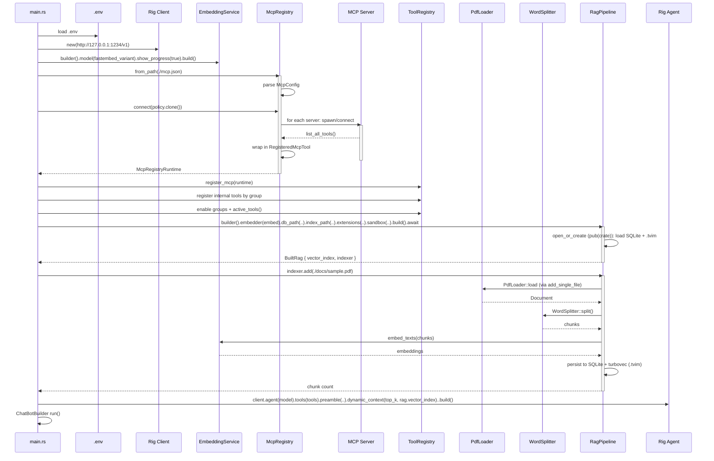
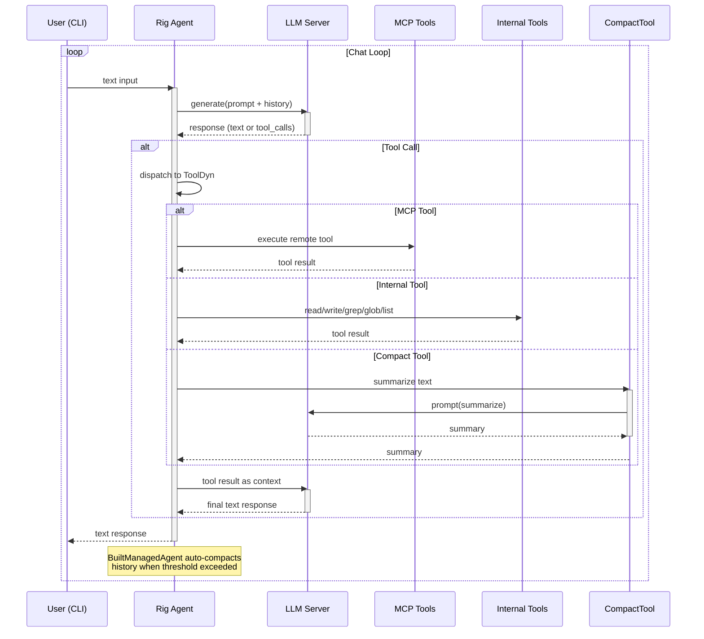

# Sequence Diagrams

## Startup Flow

```mermaid
sequenceDiagram
    participant Main as main.rs
    participant DotEnv as .env
    participant RigClient as Rig Client
    participant Embed as EmbeddingService
    participant McpReg as McpRegistry
    participant McpSrv as MCP Server
    participant Tools as ToolRegistry
    participant Pdf as PdfLoader
    participant Splitter as WordSplitter
    participant Rag as RagPipeline
    participant Agent as Rig Agent

    Main->>DotEnv: load .env
    Main->>RigClient: new(http://127.0.0.1:1234/v1)
    Main->>Embed: builder().model(fastembed_variant).show_progress(true).build()
    Main->>McpReg: from_path(./mcp.json)
    activate McpReg
    McpReg->>McpReg: parse McpConfig
    Main->>McpReg: connect(policy.clone())
    McpReg->>McpSrv: for each server: spawn/connect
    activate McpSrv
    McpSrv-->>McpReg: list_all_tools()
    McpReg->>McpReg: wrap in RegisteredMcpTool
    deactivate McpSrv
    McpReg-->>Main: McpRegistryRuntime
    deactivate McpReg
    Main->>Tools: register_mcp(runtime)
    Main->>Tools: register internal tools by group
    Main->>Tools: enable groups + active_tools()

    Main->>Rag: builder().embedder(embed).db_path(..).index_path(..).extensions(..).sandbox(..).build().await
    activate Rag
    Rag->>Rag: open_or_create (pub(crate)): load SQLite + .tvim
    Rag-->>Main: BuiltRag { vector_index, indexer }
    deactivate Rag
    Main->>Rag: indexer.add(./docs/sample.pdf)
    activate Rag
    Rag->>Pdf: PdfLoader::load (via add_single_file)
    Pdf-->>Rag: Document
    Rag->>Splitter: WordSplitter::split()
    Splitter-->>Rag: chunks
    Rag->>Embed: embed_texts(chunks)
    Embed-->>Rag: embeddings
    Rag->>Rag: persist to SQLite + turbovec (.tvim)
    Rag-->>Main: chunk count
    deactivate Rag

    Main->>Agent: client.agent(model).tools(tools).preamble(..).dynamic_context(top_k, rag.vector_index)..build()
    Main->>Main: ChatBotBuilder run()
```

## Runtime Chat Loop

```mermaid
sequenceDiagram
    participant User as User (CLI)
    participant Agent as Rig Agent
    participant LLM as LLM Server
    participant MCP as MCP Tools
    participant Internal as Internal Tools
    participant Compact as CompactTool

    loop Chat Loop
        User->>Agent: text input
        activate Agent
        Agent->>LLM: generate(prompt + history)
        activate LLM
        LLM-->>Agent: response (text or tool_calls)
        deactivate LLM

        alt Tool Call
            Agent->>Agent: dispatch to ToolDyn
            alt MCP Tool
                Agent->>MCP: execute remote tool
                MCP-->>Agent: tool result
            else Internal Tool
                Agent->>Internal: read/write/grep/glob/list
                Internal-->>Agent: tool result
            else Compact Tool
                Agent->>Compact: summarize text
                activate Compact
                Compact->>LLM: prompt(summarize)
                LLM-->>Compact: summary
                deactivate Compact
                Compact-->>Agent: summary
            end
            Agent->>LLM: tool result as context
            activate LLM
            LLM-->>Agent: final text response
            deactivate LLM
        end

        Agent-->>User: text response
        deactivate Agent

        Note over Agent: BuiltManagedAgent auto-compacts<br/>history when threshold exceeded
    end
```
