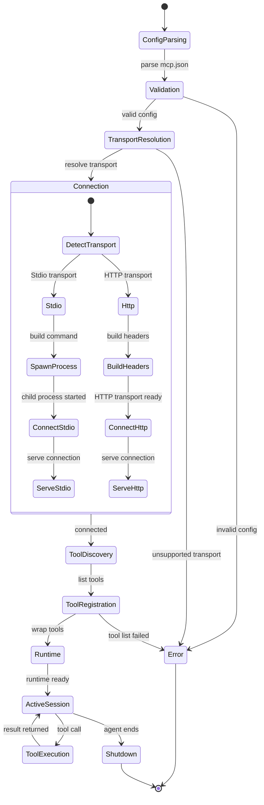

# MCP Server Connection Lifecycle

```mermaid
stateDiagram-v2
    [*] --> ConfigParsing

    ConfigParsing --> Validation: parse mcp.json
    Validation --> TransportResolution: valid config
    Validation --> Error: invalid config

    TransportResolution --> Connection: resolve transport
    TransportResolution --> Error: unsupported transport

    state Connection {
        [*] --> DetectTransport
        DetectTransport --> Stdio: Stdio transport
        DetectTransport --> Http: HTTP transport

        Stdio --> SpawnProcess: build command
        SpawnProcess --> ConnectStdio: child process started
        ConnectStdio --> ServeStdio: serve connection

        Http --> BuildHeaders: build headers
        BuildHeaders --> ConnectHttp: HTTP transport ready
        ConnectHttp --> ServeHttp: serve connection
    }

    Connection --> ToolDiscovery: connected
    ToolDiscovery --> ToolRegistration: list tools
    ToolRegistration --> Runtime: wrap tools
    ToolRegistration --> Error: tool list failed

    Runtime --> ActiveSession: runtime ready
    ActiveSession --> ToolExecution: tool call
    ToolExecution --> ActiveSession: result returned
    ActiveSession --> Shutdown: agent ends

    Error --> [*]
    Shutdown --> [*]
```
